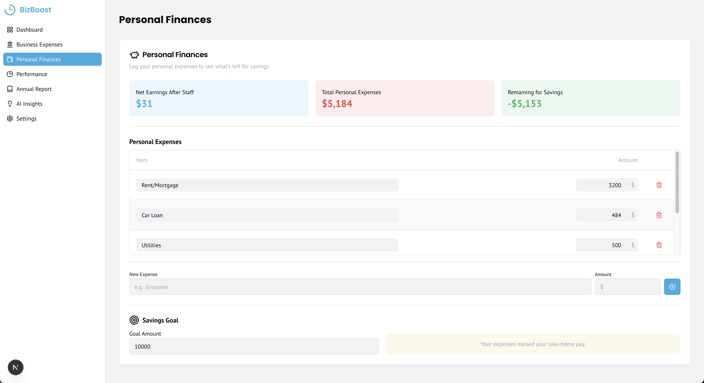
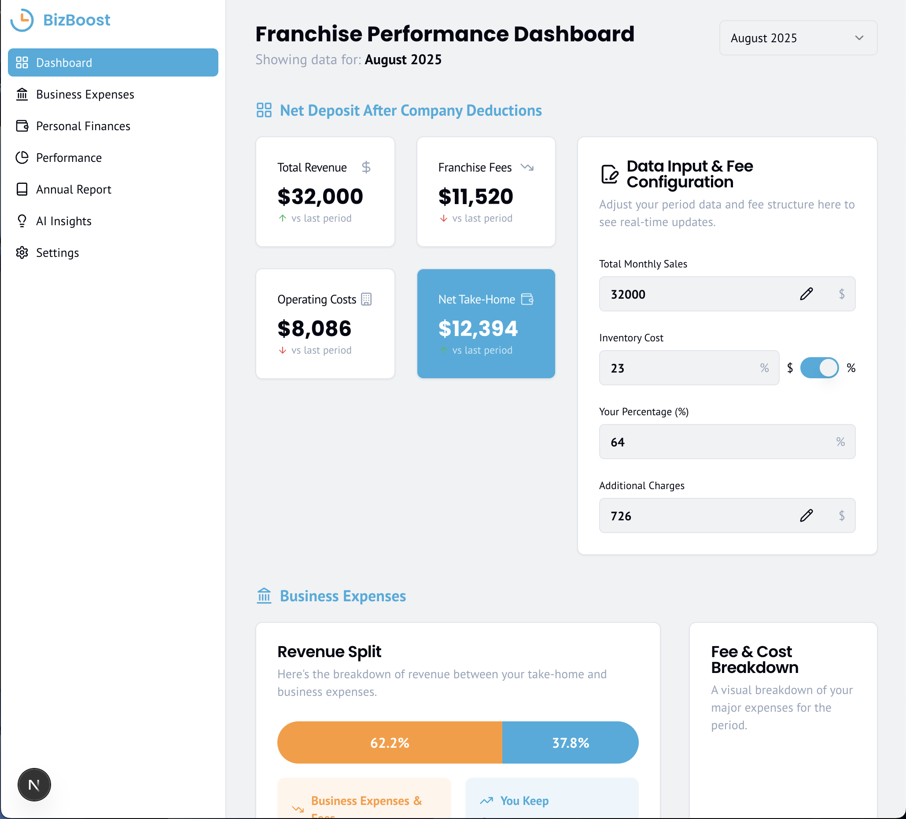
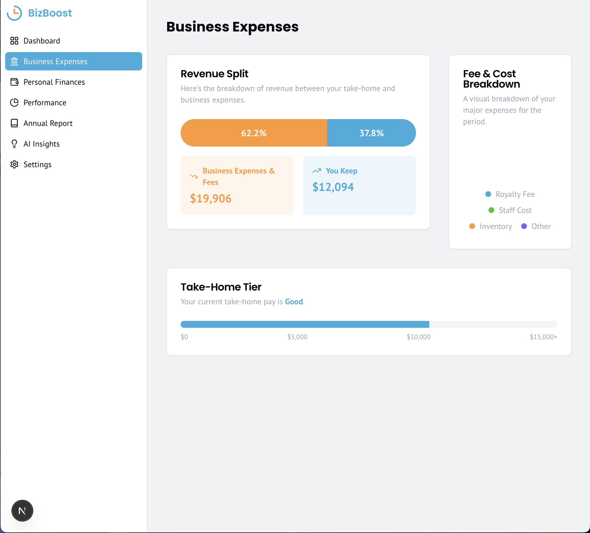
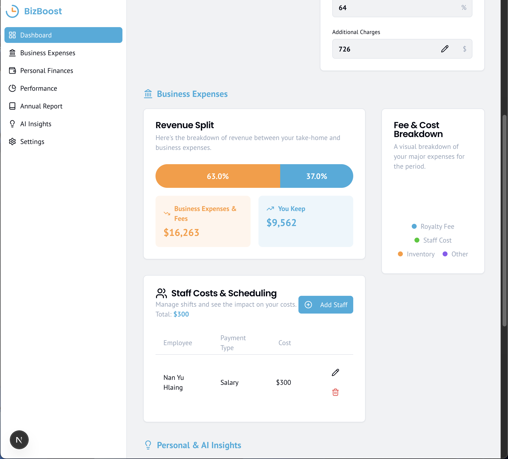
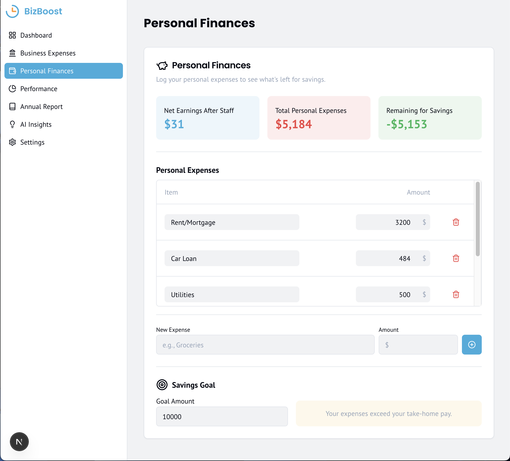

<p align="center">
  
</p>

<p align="center">
  
  
  
  
  
</p>

<h2 align="center">✨ Repo Name ✨</h2>

<p align="center">
  Franchise Dashboard Calculator is a smart web app that helps small business owners track revenue, calculate fees, manage staff costs, and see real take-home profit—visually and clearly. Built with Next.js, Tailwind CSS, and Appwrite, it's fast, mobile-friendly, and future-ready
</p>

---

## 🔥 Features

- ⚡️ **Intuitive Dashboard:** Gain a clear, visual overview of your franchise's financial health.
- 📊 **Revenue & Fee Tracking:** Effortlessly monitor income and calculate various franchise fees.
- 💰 **Staff Cost Management:** Efficiently manage and track employee-related expenses.
- 📈 **Real-time Profit Analysis:** See your true take-home profit with dynamic calculations.
- 📱 **Responsive Design:** Access your dashboard seamlessly on any device, from desktop to mobile.
- 🚀 **Performance Optimized:** Built with Next.js and Tailwind CSS for a fast and smooth user experience.
- 🧠 **Smart Calculations:** Leverage intelligent algorithms for accurate financial insights and projections.

---

## 📸 Screenshot

<table align="center">
  <tr>
    <td colspan="2"></td>
  </tr>
  <tr>
    <td></td>
    <td></td>
  </tr>
  <tr>
    <td></td>
    <td></td>
  </tr>
</table>

---

## 🚀 Live Demo

👉 [Visit The Website](https://biz-boost-five.vercel.app/)

---

## 🛠️ Setup & Run

```bash
git clone https://github.com/SawSimonLinn/BizBoost
cd BizBoost
npm install

npm run dev
```

## 🔑 Environment Variables

To run this project, you will need to add the following environment variables to your .env file:

```
GEMINI_API_KEY=your_api_key_here

```

---

## 💬 Feedback

Feel free to connect with me or drop feedback via [LinkedIn](https://www.linkedin.com/in/sawsimonlinn/). Let’s build something magical together! 💻✨

---

## 📄 License

This project is licensed under the MIT License.
